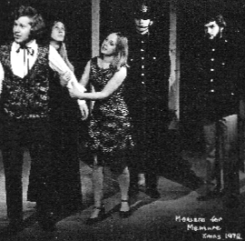



  

  Welcome to the New Theatre History Project, a historical record of happenings at the New Theatre.

  The New Theatre Alumni Network was founded in order to build a stronger sense of the history of the theatre, and with the launch of this project we are hoping to do just that! Following a recent visit to Manuscripts and Special Collections, we are using the project to piece together the New Theatre's dynamic and vibrant history.

  {: .right}

  > "whether you were an actor, a director, a stage-manager or an audience member, we want you to get in touch with you memories from the New Theatre"

  This is an extremely exciting project for the Alumni Network, and we are relying on as many people as possible getting involved and contributing to the story – whether you were an actor, a director, a stage-manager or an audience member, we want you to get in touch with you memories from your time at the New Theatre.

  In particular we are looking for: listings of season shows, casts and crew lists, photographs, programmes, flyers, reviews and anything else which could provide an insight into the history of the theatre.

  Please email us at <{{ site.email }}> if you have something to contribute, and don’t worry if you aren’t quite ready to part with your cherished New Theatre relics just yet – Manuscripts and Special Collections have offered to photgraph and document any items sent to them, and then return them safely to you for safe keeping!

  

  

  
  

